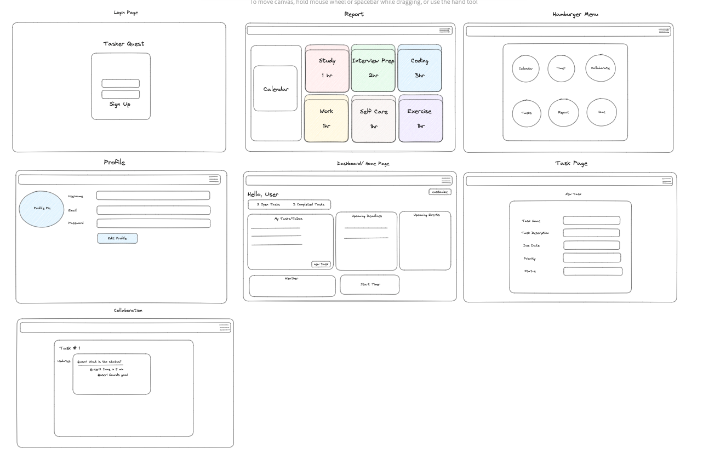

# `Tasker Quest`

An event tracker application to help you remember those important dates!

## How to Install
1. `Fork` and `Clone` the tasker.quest and tasker.quest-backend repositories in your terminal
2. Open both in separate terminals and run `npm i` to install dependencies 
4. Run `npm run dev` to connect to servers in backend and frontend terminals
5. Open `http://localhost:3000` in your web browser

## Accessing the Website Online
Visit: taskerquest.netlify.app

## User stories 
- As a user, I want to be able to create tasks so that I can keep track of my to-do list and prioritize my work.
- As a user, I want to be able to set due dates for tasks so that I can manage my time effectively and meet deadlines.
- As a user, I want to be able to view and track the progress of tasks so that I can see how much has been completed and what still needs to be done.
- As a user, I want to be able to organize tasks into different categories or projects so that I can easily find and manage related tasks.

## Wireframe

## Using the Website
1. Sign up for an account
2. Log in
3. Navigate to new event page to create your first event

## Languages and Frameworks Used
- JS
- React
- MongoDB
- CSS
- Bootstrap
- Bulma

## Blockers
- Time
- Github version controls
- Getting our models working

## Future Goals/Unsolved Problems
1. Improve UI/UX
2. Get the tasks model working
3. Get the planned dashboard and report pages working
4. Get the planned collaboration feature working
